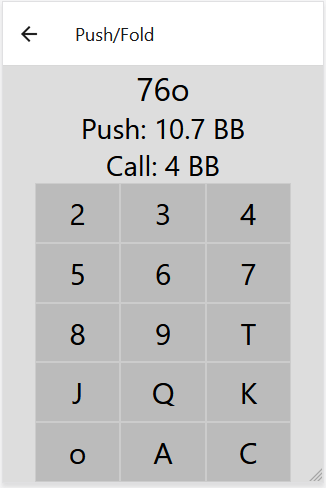
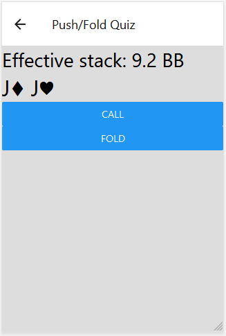

# PokerHelper
App for shortstack NLHE push/fold decisions. Under construction.
Implemented using React Native and Typescript.
Push/Fold charts are saved in push.json and call.json.
Numerical data for hands in file tell range on which you should push/call, currently only upper limit is used.

 